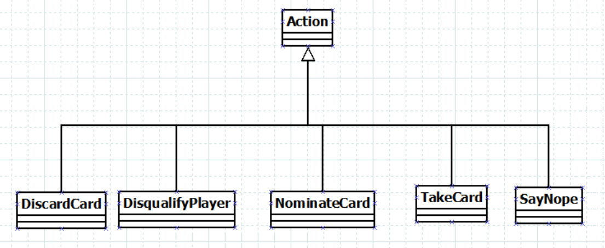

# JSON-Schnittstelle  

## Einleitung

Dieses Dokument beschreibt den Aufbau der Implementierung der JSON-Schnittstelle.
Hier wird insbesondere auf die Implementierung eingegangen. Zu finden ist
die Implementierung im Paket gameobjects.

## Interface IJsonable

Jedes der implementierten JSON-Objekte implementiert das Interface
IJsonable. Dieses besitzt eine Methode, die ein Objekt
als JSON-String zurückliefern soll.

Implementiert sind diese Methoden hauptsächlich durch folgende
Syntax:

    return new Gson().toJson(this);

Jedoch wurde aufgrund eines Serverupdates die Implementierung
für die toJSON()-Methode in der Klasse NominateCard.java
angepasst:

    if (nominatedColor != null) {
            return new Gson().toJson(this);
    } else {
        return new Gson().toJson(new NominateCard(this.getType(), this.getExplanation(), this.getAmount(),  this.getCards(), this.getPlayer(), this.getNominatedPlayer(), this. nominatedAmount));
    }

Es darf wegen des Updates bei Auswahlkarten mit Farbe die Farbe selbst nicht mitgeschickt werden.  

## Allgemeine Richtlinien

Bei der Implementierung wurde nach folgenden Richtlinien gehandelt:

1. boolsche Werte (true oder false) werden als boolean gespeichert.
2. numerische Werte (float oder int) werden jeweils als solche gespeichert.
3. Listenobjekte von JSON-Objekten werden als java.util.List gespeichert.
4. Dicts der JSON-Objekte werden als Objekte der jeweiligen Klasse gespeichert.
5. Strings in JSON-Objekten werden als java.lang.String gespeichert.

## Konstruktoren

Jede Klasse besitzt mindestens zwei Konstruktoren:

1. einen Standard-Konstruktor, welcher als Parameter sämtliche Attribute besitzt
2. einen JSON-Konstruktor, welcher einen JSON-String übergeben bekommt, dieser wird
   mithilfe der Gson-Bibliothek geparst und das Objekt wird daraus erstellt. Bei dem Erzeugen
   von Java-Objekten benutzen wir eine Kombination von Gson-Objekten und JSONObject-Objekten.

## Getter und Setter

Jede Klasse besitzt für die jeweiligen Attribute Getter- und Settermethoden, um
diese Attribute auszulesen und auch ändern zu können.

## Implementierung

Die Klassen wurden als Kombination von Gson und JSONObject implementiert, hier 
ein Beispiel mit Gson():

    public NumberCard(String jsonString) {
        super(jsonString);
        Gson gson = new Gson();
        this.value = gson.fromJson(jsonString,getClass()).getValue();
    }

Die Klasse NumberCard hat nicht viele Attribute, wodurch sie leicht mit Gson
implementiert werden kann.

Andere Klassen jedoch haben mehr Attribute, welche Objekte anderer Klassen enthalten
können, daher wurde neben Gson auch JSONObject benutzt. Hier ein Beispiel: 

    public Tournament(String jsonString) {
        try {
            JSONObject tournamentObject = new JSONObject(jsonString);
            this.id = tournamentObject.getString("id");
            this.mode = new Mode(tournamentObject.getJSONObject("mode").toString());
            // participants
            JSONArray participantArray = tournamentObject.getJSONArray("participants");
            this.participants = new ArrayList<>();
            for (int iterator = 0; iterator < participantArray.length(); iterator++) {
                this.participants.add(new TournamentParticipant(participantArray.getJSONObject(iterator).toString()));
            }
        }
        // Restlicher Code hier ausgelassen

In dem Konstruktor der Klasse Tournament werden Turnierteilnehmer (TournamentParticipants) benötigt.
Da diese einen JSON-Konstruktor hat, wird dieser bei der Iteration benutzt.

Bei manchen Klassen werden einige Attribute nicht mitgesendet, da diese noch nicht berechnet worden sind serverseitig. Daher wird eine Möglichkeit benötigt, diese nicht vorhandenen Attribute abzufangen. Hier ein Beispiel:

    public Game(String jsonString) {
        try {
            JSONObject gameObject = new JSONObject("jsonString");
            // Attribute, die immer mitgesendet werden, ausgelassen

            try {
                lastNominateAmount = gameObject.getInt("lastNominateAmount");
            } catch (JSONException ignored){

            }

            try {
                lastNominateColor = gameObject.getString("lastNominateColor");
            } catch (JSONException ignored) {

            }
        } catch (JSONException ignored) {
        }
    }

Die Attribute werden vom Server nicht immer mitgesendet, daher werden
diese abgefangen und wenn sie nicht vorhanden sind, einfach nicht gesetzt.

## Vererbung

Bei einigen JSON-Objekten wurden Gemeinsamkeiten lokalisiert, welche
entsprechend in einer Vererbungshierarchie zusammengefasst worden sind.

### Karten

Für die Nummernkarten und Aktionskarten wurde eine
Vererbungshierarchie erstellt, die folgendermaßen aufgebaut ist:

Aktionskarten und Nummerkkarten sind nahezu gleich bezogen auf die Attribute, dennoch hat die 
Nummernkarte ein Attribut mehr, den Wert der Karte.

Erzeugt werden die verschiedenen Kartentypen über eine Klasse CardFactory.java.

### Aktionen

Es sind 5 verschiedene Aktionen implementiert worden, welche
von dem Client erzeugt werden und per Websocket via socket.emit(); an
den Server gesendet werden: 

1. DiscardCard (wirft Karten ab)
2. DisqualifyPlayer (disqualifiziert einen Spieler)
3. NominateCard (wählt einen Spieler mit der Auswahlkarte aus)
4. SayNope ("nope" sagen, das Spiel geht mit dem nächsten Spieler weiter)
5. TakeCard (eine unbekannte Karte vom Ablagestapel nehmen)

Die Vererbungshierarchie der Java-Klassen sieht folgendermaßen aus: 

 

Die Oberklasse Action beinhaltet die Attribute, die alle Attribute
gemeinsam haben: den Typ (type) und die Erklärung (explanation) 

Bei den Unterklassen kommen jeweils neue Attribute dazu:

1. DiscardCard: Menge an Karten (amount), eine Liste an Karten (cards), und den betroffenen Spieler (player)
2. DisqualifyPlayer: den betroffenen Spieler (player)
3. NominateCard: Menge an Karten (amount), eine Liste an Karten (cards), den Spieler der Aktion (player),
    den ausgewählten Spieler (nominatedPlayer), die Farbe der Auswahl (nominatedColor), die Anzahl Karten (nominateAmount)
4. TakeCard: eine Menge an Karten (amount), eine Kartenliste (cards), und den Spieler der Aktion (player)
5. SayNope: Spieler, der "nope" sagt (player)

Erzeugt werden Aktionen durch die Konstruktoren der Klasse. Ebenso ist es möglich,
diese Attribute mittels ActionFactory.java zu erzeugen.